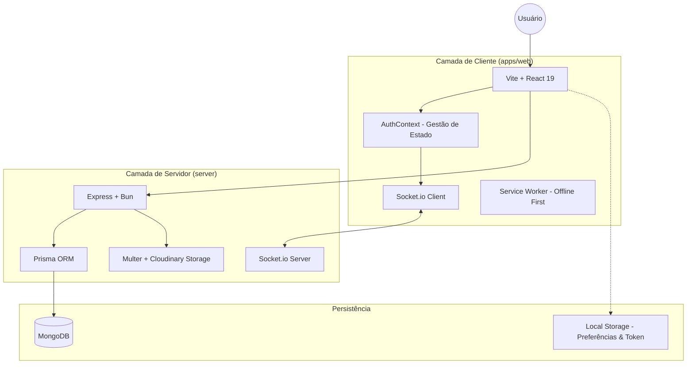

# Arquitetura do Sistema FLASH

O FLASH é um sistema de gestão operacional em tempo real projetado para alta disponibilidade e baixa latência, utilizando uma arquitetura baseada em eventos.

## Visão Geral

O projeto é estruturado como um monorepo utilizando **Bun Workspaces**, o que permite o compartilhamento de tipos e configurações entre o frontend e o backend de forma eficiente.

## Pilha Tecnológica (Tech Stack)

### Core

- **Monorepo Manager**: Bun (Workspaces)
- **Runtime**: Bun (Backend e Ferramentas)

### Backend (`/server`)

- **Linguagem**: TypeScript
- **Framework**: Express.js
- **Banco de Dados**: MongoDB (via Prisma ORM)
- **Comunicação em Tempo Real**: Socket.io
- **Storage**: Cloudinary (para imagens e áudios)
- **Autenticação**: JWT (JSON Web Tokens)

### Frontend (`/apps/web`)

- **Framework**: React 19
- **Build Tool**: Vite
- **Estilização**: CSS Modules / Vanilla CSS (Moderno)
- **Ícones**: Lucide React
- **Estado Global**: React Context API
- **Sincronização**: React Query (TanStack Query)
- **PWA**: Vite PWA Plugin (Suporte offline)

## Fluxo de Comunicação

1. **HTTP/REST**: Utilizado para operações de CRUD (Login, Cadastro, Listagens pesadas, Upload de Mídias).
2. **WebSockets (Socket.io)**: Utilizado para Chat em tempo real, Notificações instantâneas e Eventos de Conferência.
3. **Offline-First**: O sistema utiliza um Service Worker e LocalStorage para permitir que certas operações funcionem mesmo com instabilidade de rede.

## Estrutura de Pastas

- `apps/web`: Aplicativo frontend completo.
- `server`: API backend e lógica de sockets.
- `packages/`: (Reservado) Pacotes compartilhados de tipos e constantes.
- `docs/`: Documentação técnica do sistema.
